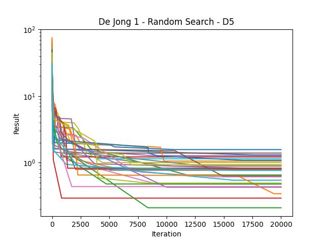
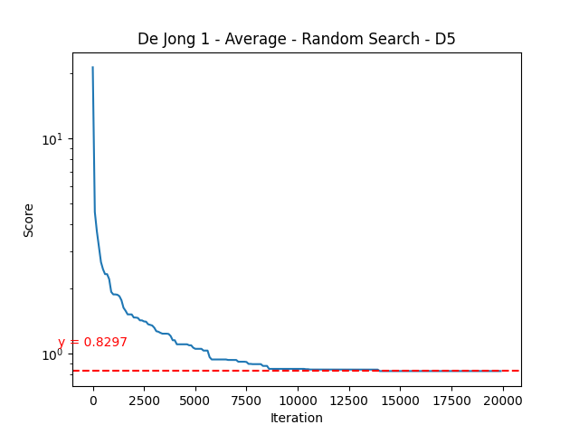
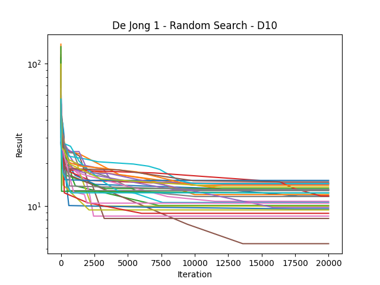
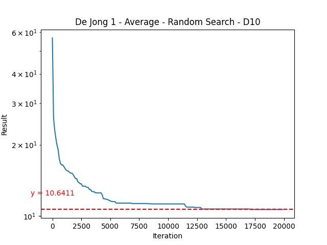
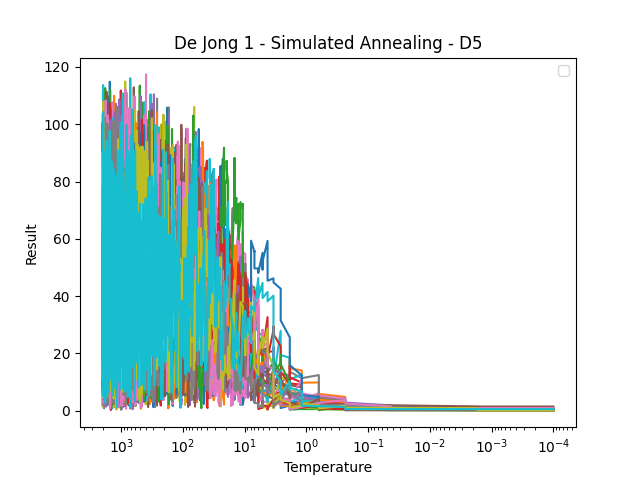
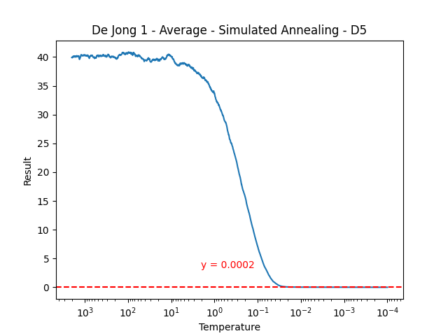
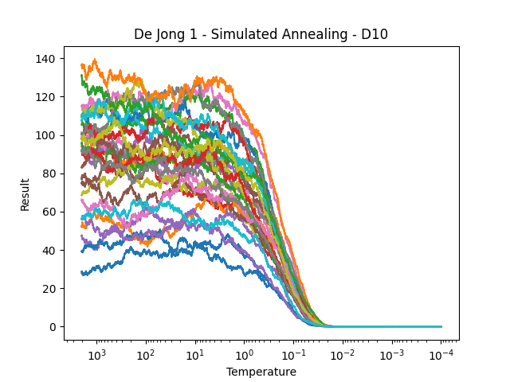
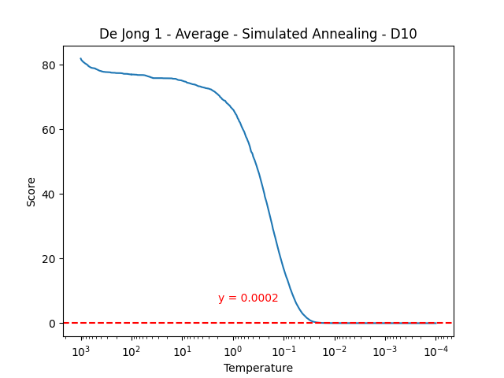

# ZÁPOČTOVÝ ÚKOL DO MATEMATICKÉ INFORMATIKY

## Osnova

1. [Benchmarking úloha](#benchmarking-úloha)
2. [Praktická úloha](#praktická-úloha)

## Benchmarking úloha

Dle zadání jsem se rozhodl u všeho pracovat s FES 10000, která sice v některých fázích limitovala, ale představovala
grounded hodnotu, která byla pro všechny algoritmy stejná. Náročnost výsledků je tedy porovnatelná.

### Dejong1

#### Random Search

Random search si vedl dobře v malém prostoru, s dobrou "konsistencí"(heh) se dostal na nízkou hodnotu, ale přiblížit 
se ideálnímu řešení už konsistentně nedokázal. To bylo obzvlášť pozorovatelné u dimenze 10. 

 

#### Simulated Annealing

Simulated annealing byl lepší ve větším prostoru

