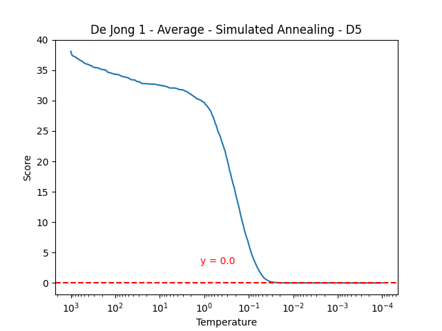
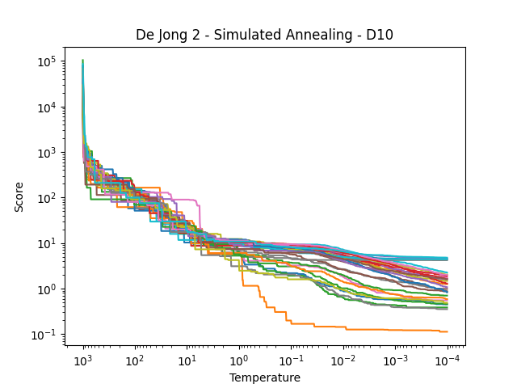
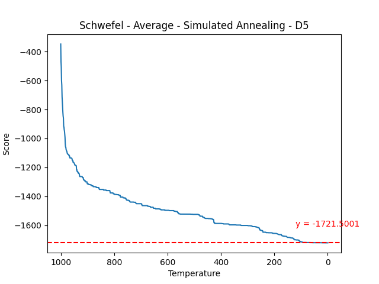
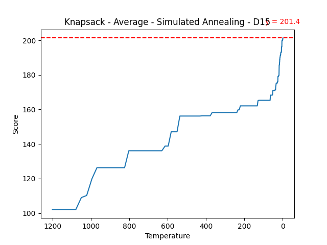
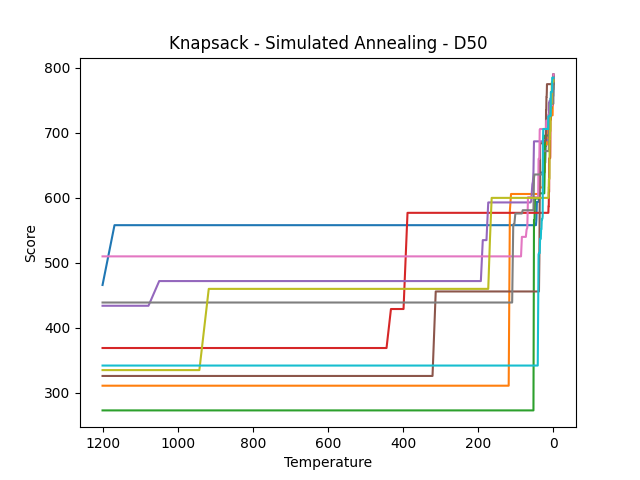
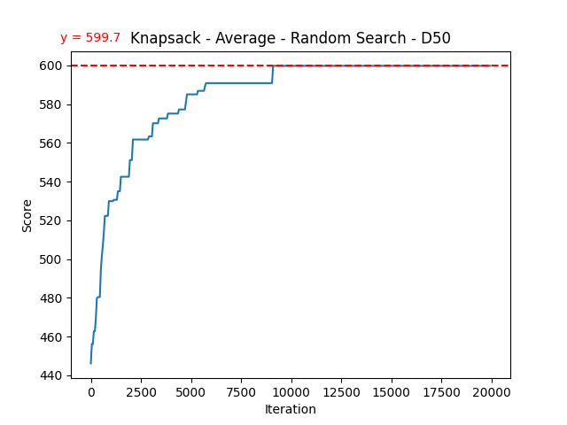

# ZÁPOČTOVÝ ÚKOL DO MATEMATICKÉ INFORMATIKY

## Benchmarking úloha

### Dejong1

Jednoduchá funkce, logika za parametry je co nejmenší odchylka pro normální distribuci
a tedy co nejmenší skoky, jednoduše nechat algoritmus zklouznout do minima. Tomu odpovídá
i fce chlazení, která chladí o poměrnou část a postupně zpomaluje.

Parametry:

```python
- FES = 20000
- temp_target = 0.0001
- temp_init = 2000
- metropolis_n = 10
- std = 0.01
- cooling = lambda temp: temp - temp * 0.984
- bounds = [-5, 5]
```

#### Dimenze 5

 





```text
De Jong 1 - Stats - Random Search - D5
Minimum: 0.22517357665822718
Maximum: 1.7122778814960458
Mean: 0.8296874558940225
Median: 0.8224455223032716
Standard Deviation: 0.3315816939607791
```

VS

```text
De Jong 1 - Stats - Simulated Annealing - D5
Minimum: 2.766679298903919e-05
Maximum: 0.00034502196055047633
Mean: 0.0001628164815149763
Median: 0.00016398412263585502
Standard Deviation: 7.413491973193259e-05
```

#### Dimenze 10


```text
De Jong 1 - Stats - Random Search - D10
Minimum: 4.8494922230174105
Maximum: 13.937777488705152
Mean: 10.341127982109432
Median: 10.217839812053295
Standard Deviation: 2.1277805164439805
```

VS

```text
De Jong 1 - Stats - Simulated Annealing - D10
Minimum: 0.00013337222732238337
Maximum: 0.0008870717964375043
Mean: 0.0004384625347050692
Median: 0.0004713043072484819
Standard Deviation: 0.0001730184780874394
```

### Dejong2

Podobná situace, ale přítomnost "sedel" vyžaduje větší skoky, aby byl annealing
schopný vyšplhat z lokálního minima. Ty jsou ale v závěru zase zmenšeny, aby se nadrobno mohlo dohledat minimum.
Z testování vyplynulo, že nejvodnější způsob chlazení je zase poměrový.

Jak u dim 5 tak i 10 je vidět, že pro většinu běhu annealing v lok. minimu uvázne.
 
Parametry:

```python
- FES = 20000
- temp_target = 0.0001
- temp_init = 1000
- metropolis_n = 20
- std = devitation_adaptive2
- cooling = lambda temp: temp - temp * 0.984
- bounds = [-5, 5]

def devitation_adaptive2(temp):
    if temp > 60:
        return 0.5
    if temp > 1:
        return 0.1
    return 0.005
```

#### Dimenze 5

 


```text
De Jong 2 - Stats - Random Search - D5
Minimum: 16.275723738956117
Maximum: 114.46302840383072
Mean: 57.769738476698286
Median: 56.959010385331496
Standard Deviation: 24.182548507985175
```

VS

```text
De Jong 2 - Stats - Simulated Annealing - D5
Minimum: 0.0004994566944266223
Maximum: 5.279813474070098
Mean: 0.48636243798152395
Median: 0.03404479264159451
Standard Deviation: 1.3572815802391134
```

#### Dimenze 10





```text
De Jong 2 - Stats - Random Search - D10
Minimum: 644.1287162122458
Maximum: 4284.643292017868
Mean: 2284.760420575056
Median: 2077.8790887980576
Standard Deviation: 967.4509923856659
```

VS

```text
De Jong 2 - Stats - Simulated Annealing - D10
Minimum: 0.11279200041126061
Maximum: 4.773072247166481
Mean: 1.6605061647251247
Median: 1.274276120412463
Standard Deviation: 1.3787749043508917
```

### Schwefel

Pro schwefel bylo potřeba kvůli tvaru benchmark fce a velikosti prostoru
vycházet při norm.dist z poměru velikosti prostoru. Zároveň nebylo vhodné rychle
přejít do hledání minima, takže chlazení lineární.

Parametry:

```python
- FES = 20000
- temp_target = 0.0001
- temp_init = 1000
- metropolis_n = 20
- std = norm.dist 10% prostoru
- cooling = lambda temp: temp / (1 + temp * 0.995)
- bounds = [-500, 500]
```

#### Dimenze 5

 




```text
Schwefel - Stats - Random Search - D5
Minimum: -1892.3683488673316
Maximum: -1536.2494993348207
Mean: -1675.57489587996
Median: -1649.505594251017
Standard Deviation: 93.37609081156974
```

VS

```text
Schwefel - Stats - Simulated Annealing - D5
Minimum: -2072.2307096747522
Maximum: -971.8514703943413
Mean: -1496.2752805605712
Median: -1473.5442215640933
Standard Deviation: 250.4479140187846
```

#### Dimenze 10


```text
Schwefel - Stats - Random Search - D10
Minimum: -2731.6308857130953
Maximum: -2138.2215688002807
Mean: -2410.0254694485984
Median: -2390.966748428341
Standard Deviation: 153.8040028809002
```

VS

```text
Schwefel - Stats - Simulated Annealing - D10
Minimum: -3306.816179927907
Maximum: -1956.2912061081377
Mean: -2852.9755201166486
Median: -2940.8468915150142
Standard Deviation: 377.79837975585446
```

## Knapsack úloha

Nejlepší výsledky podává poměrné chlazení a zvyšování metropolise v poměru k dimenzi. Překvapivě
testování s větší pravděpodobností k změně při vyšší teplotě nedosáhlo lepších výsledků
(ani s lineárním chlazením).

Annealing je lepší ve všech případech. Vyhovující je chování při nízké teplotě, kdy se chytne nějakého stavu baťohu
a hledá "maximum" lokálně při současném uspořádání.

Parametry:

```python
- FES = dim * 400
- temp_target = 0.0001
- temp_init = 1200
- metropolis_n = 2 * dim / 3
- uniform distribution (0, 1)
- cooling =  lambda temp: temp - temp * 0.9735
- bounds = [0, 1]
```

### Dimenze 15 (poč. předmětů)

 
 

 


 

```text
Knapsack - Stats - Random Search - D15
Minimum: 192
Maximum: 202
Mean: 196.8
Median: 197.5
Standard Deviation: 3.1559467676119
```

VS

```text
Knapsack - Stats - Simulated Annealing - D15
Minimum: 199
Maximum: 202
Mean: 201.4
Median: 202.0
Standard Deviation: 1.2
```

### Dimenze 30

 
 

 
 

 

```text
Knapsack - Stats - Random Search - D30
Minimum: 345
Maximum: 371
Mean: 360.4
Median: 364.5
Standard Deviation: 8.76584280032445
```

VS

```text
Knapsack - Stats - Simulated Annealing - D30
Minimum: 424
Maximum: 442
Mean: 436.2
Median: 439.0
Standard Deviation: 6.867313885355759
```

### Dimenze 50

 
 

 
 

 

```text
Knapsack - Stats - Random Search - D50
Minimum: 546
Maximum: 632
Mean: 599.7
Median: 603.0
Standard Deviation: 23.765731631910683
```

VS

```text
Knapsack - Stats - Simulated Annealing - D50
Minimum: 776
Maximum: 790
Mean: 784.8
Median: 785.0
Standard Deviation: 4.534313619501853
```
