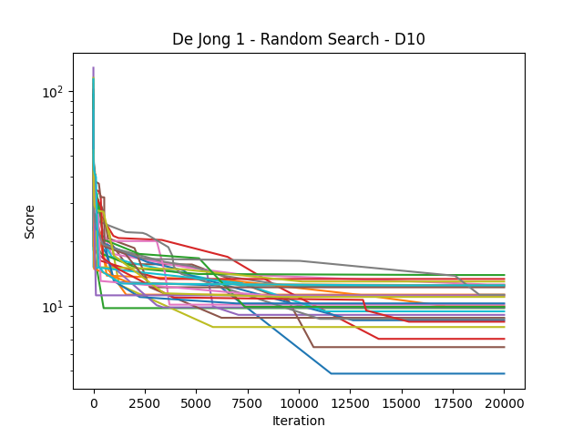
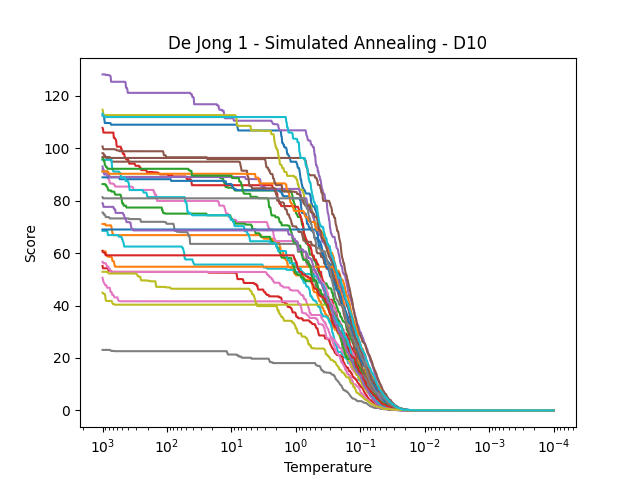
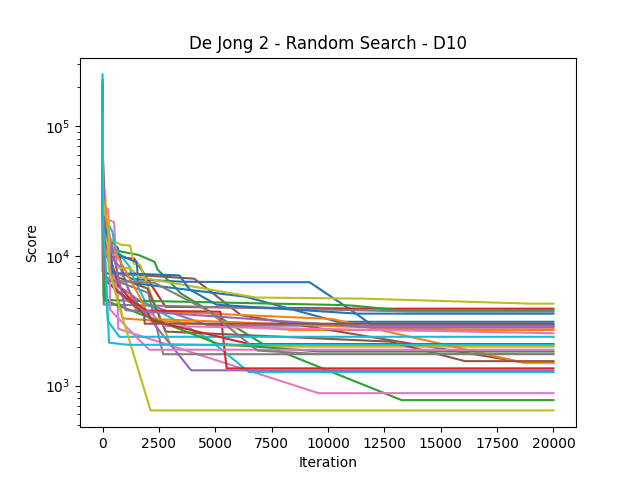
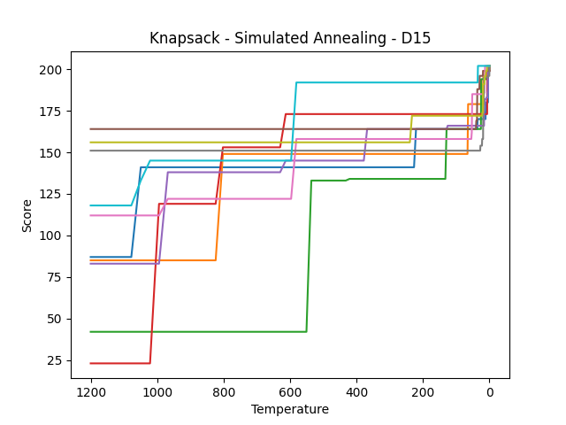

# ZÁPOČTOVÝ ÚKOL DO MATEMATICKÉ INFORMATIKY

## Benchmarking úloha

### Dejong1

Jednoduchá funkce, logika za parametry je co nejmenší odchylka pro normální distribuci
a tedy co nejmenší skoky, jednoduše nechat algoritmus zklouznout do minima. Tomu odpovídá
i fce chlazení, která chladí o poměrnou část a postupně zpomaluje.

Parametry:

```python
- FES = 20000
- temp_target = 0.0001
- temp_init = 2000
- metropolis_n = 10
- std = 0.01
- cooling = lambda temp: temp - temp * 0.99163
- bounds = [-5, 5]
```

#### Dimenze 5

 


```text
De Jong 1 - Stats - Random Search - D5
Minimum: 0.20944927045528083
Maximum: 1.5695613430879192
Mean: 0.8045078025590391
Median: 0.795472353163114
Standard Deviation: 0.34076004380968034
```

VS

```text
De Jong 1 - Stats - Simulated Annealing - D5
Minimum: 2.5934917596988985e-05
Maximum: 0.0004494675138954939
Mean: 0.00015831745965888108
Median: 0.00014626719326912537
Standard Deviation: 9.113264932917041e-05
```

#### Dimenze 10





```text
De Jong 1 - Stats - Random Search - D10
Minimum: 6.478571449663781
Maximum: 14.354361813627015
Mean: 10.64107086202358
Median: 10.715540821947378
Standard Deviation: 2.004303947294363
```

VS

```text
De Jong 1 - Stats - Simulated Annealing - D10
Minimum: 9.678184039336131e-05
Maximum: 0.0008564815773672686
Mean: 0.0004420558786349618
Median: 0.00042986281885357353
Standard Deviation: 0.0002011513531024227
```

### Dejong2

Podobná situace, ale přítomnost "sedel" vyžaduje větší skoky, aby byl annealing
schopný vyšplhat z lokálního minima. Ty jsou ale v závěru zase zmenšeny, aby se nadrobno mohlo dohledat minimum.
Z testování vyplynulo, že nejvodnější způsob chlazení je zase poměrový.

Jak u dim 5 tak i 10 je vidět, že pro většinu běhu annealing v lok. minimu uvázne.
 
Parametry:

```python
- FES = 20000
- temp_target = 0.0001
- temp_init = 2000
- metropolis_n = 10
- std = devitation_adaptive2
- cooling = lambda temp: temp - temp * 0.99163
- bounds = [-5, 5]

def devitation_adaptive2(temp):
    if temp > 60:
        return 0.5
    if temp > 1:
        return 0.1
    return 0.005
```

#### Dimenze 5

 


```text
De Jong 2 - Stats - Random Search - D5
Minimum: 21.841840729771782
Maximum: 133.59858086487546
Mean: 70.94915636658169
Median: 68.93152022259738
Standard Deviation: 29.93222484440285
```

VS

```text
De Jong 2 - Stats - Simulated Annealing - D5
Minimum: 0.0005790711200341866
Maximum: 4.579077615435204
Mean: 0.583976465909145
Median: 0.040626383360990365
Standard Deviation: 1.3976553518062733
```

#### Dimenze 10




```text
De Jong 2 - Stats - Random Search - D10
Minimum: 560.705193870015
Maximum: 4052.354972645974
Mean: 2323.2950804164952
Median: 2262.6546767349846
Standard Deviation: 985.392450028147
```

VS

```text
De Jong 2 - Stats - Simulated Annealing - D10
Minimum: 0.06479416843296353
Maximum: 5.22988110231445
Mean: 1.6109761632767439
Median: 1.1735263386385797
Standard Deviation: 1.2673718176696105
```

### Schwefel

Pro schwefel byl výsledek podstatně horší, žádná iterace se nedostala k minimu, 
Úprava parametrů/analýza průběhu nepomohla výsledek příliš zlepšit. Pro dim5 dokonce random search annealing překonal v
mean hodnotě.

Parametry:

```python
- FES = 20000
- temp_target = 0.0001
- temp_init = 2000
- metropolis_n = 10
- std = deviation_adaptive
- cooling = lambda temp: temp - temp * 0.99163
- bounds = [-500, 500]

def deviation_adaptive(temp):
    if temp > 500:
        return 2.5
    if temp > 1:
        return 0.85
    return 0.25
```

#### Dimenze 5

 


```text
Schwefel - Stats - Random Search - D5
Minimum: -1855.2159377794003
Maximum: -1473.8360360060885
Mean: -1662.4612583137648
Median: -1671.3598567053045
Standard Deviation: 103.14046461599558
```

VS

```text
Schwefel - Stats - Simulated Annealing - D5
Minimum: -1542.1957590309057
Maximum: -693.2464146166012
Mean: -1093.5871989296872
Median: -1058.505801900886
Standard Deviation: 225.12283358746026
```

#### Dimenze 10


```text
Schwefel - Stats - Random Search - D10
Minimum: -2928.9473855825463
Maximum: -2113.858854789854
Mean: -2419.813988114735
Median: -2434.759739328956
Standard Deviation: 191.86752419483057
```

VS

```text
Schwefel - Stats - Simulated Annealing - D10
Minimum: -3378.9735292221594
Maximum: -1461.92396800152
Mean: -2301.110610178808
Median: -2342.5108397206463
Standard Deviation: 383.02949756081324
```

## Knapsack úloha

Nejlepší výsledky podává poměrné chlazení a zvyšování metropolise v poměru k dimenzi. Překvapivě
testování s větší pravděpodobností k změně při vyšší teplotě nedosáhlo lepších výsledků
(ani s lineárním chlazením).

Parametry:

```python
- FES = dim * 400
- temp_target = 0.0001
- temp_init = 1200
- metropolis_n = 2 * dim / 3
- uniform distribution (0, 1)
- cooling =  lambda temp: temp - temp * 0.9735
- bounds = [0, 1]
```

### Dimenze 15 (poč. předmětů)

 
 

 
  

```text
Knapsack - Stats - Random Search - D15
Minimum: 131
Maximum: 146
Mean: 142.9
Median: 145.0
Standard Deviation: 4.3
```

VS

```text
Knapsack - Stats - Simulated Annealing - D15
Minimum: 146
Maximum: 146
Mean: 146.0
Median: 146.0
Standard Deviation: 0.0
```

### Dimenze 30

 
 

 
  

```text
Knapsack - Stats - Random Search - D30
Minimum: 337
Maximum: 413
Mean: 372.3
Median: 366.0
Standard Deviation: 20.61577066228668
```

VS

```text
Knapsack - Stats - Simulated Annealing - D30
Minimum: 458
Maximum: 487
Mean: 481.1
Median: 487.0
Standard Deviation: 8.904493247793498
```

### Dimenze 50

 
 

 
  

```text
Knapsack - Stats - Random Search - D50
Minimum: 464
Maximum: 515
Mean: 500.1
Median: 507.0
Standard Deviation: 15.423683088030563
```

VS

```text
Knapsack - Stats - Simulated Annealing - D50
Minimum: 704
Maximum: 734
Mean: 723.5
Median: 726.0
Standard Deviation: 7.592759709091286
```
