# ZÁPOČTOVÝ ÚKOL DO MATEMATICKÉ INFORMATIKY

## Benchmarking úloha

### Dejong1

Jednoduchá funkce, logika za parametry je co nejmenší odchylka pro normální distribuci
a tedy co nejmenší skoky, jednoduše nechat algoritmus zklouznout do minima. Tomu odpovídá
i fce chlazení, která chladí o poměrnou část a postupně zpomaluje.

Parametry:

```python
- FES = 20000
- temp_target = 0.0001
- temp_init = 2000
- metropolis_n = 10
- std = 0.01
- cooling = lambda temp: temp - temp * 0.99163
- bounds = [-5, 5]
```

#### Dimenze 5

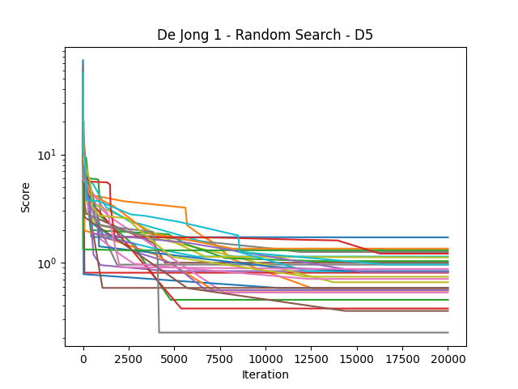 


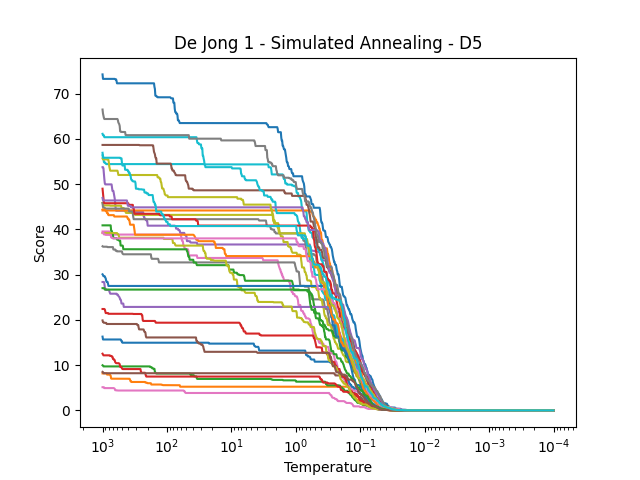


#### Dimenze 10


### Dejong2

Podobná situace, ale přítomnost "sedel" vyžaduje větší skoky, aby byl annealing
schopný vyšplhat z lokálního minima. Ty jsou ale v závěru zase zmenšeny, aby se nadrobno mohlo dohledat minimum.
Z testování vyplynulo, že nejvodnější způsob chlazení je zase poměrový.

Jak u dim 5 tak i 10 je vidět, že pro některé běhy annealingu uvázne alg. u lokálního minima.
 
Parametry:

```python
- FES = 20000
- temp_target = 0.0001
- temp_init = 2000
- metropolis_n = 10
- std = devitation_adaptive2
- cooling = lambda temp: temp - temp * 0.99163
- bounds = [-5, 5]

def devitation_adaptive2(temp):
    if temp > 60:
        return 0.5
    if temp > 1:
        return 0.1
    return 0.005
```

#### Dimenze 5

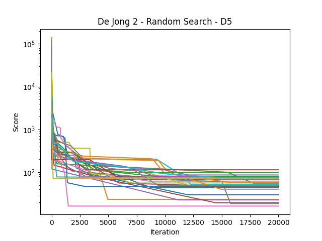 


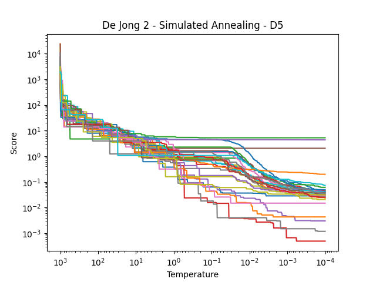


#### Dimenze 10


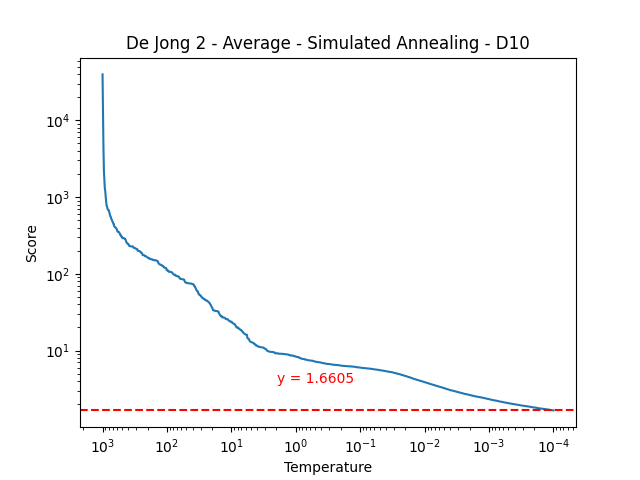

### Schwefel

bbb

Parametry:

```python
- FES = 20000
- temp_target = 0.00001
- temp_init = 1000
- metropolis_n = 20
- std = lambda temp: 2.5 * (1.5 - temp / temp_init) + 0.5
- cooling = lambda temp: temp / (1 + temp * 0.989)
- bounds = [-500, 500]
```

Konzistentní performace annealingu byl ten, že to našlo nějaké lokální minimum a tam to taky zůstalo. V průměru to bylo
cca ideal/2. Random search se v menším prostoru dokázal vydat lepší výsledek.

#### Dimenze 5

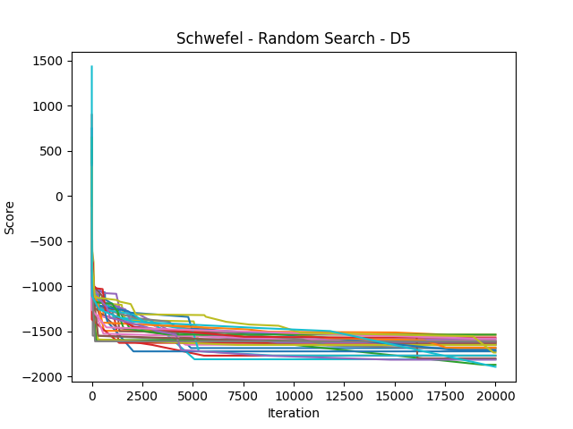 
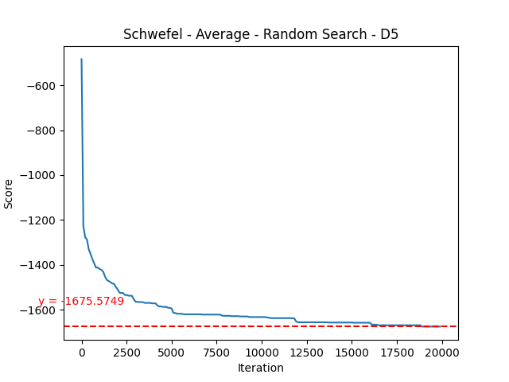

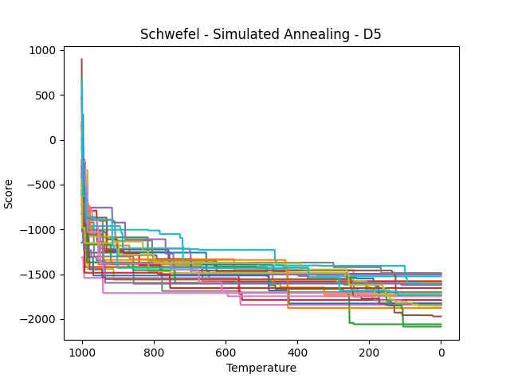


#### Dimenze 10

V dimenzi 10 podává annealing průměrně lepší výsledek, seč jen o trochu.

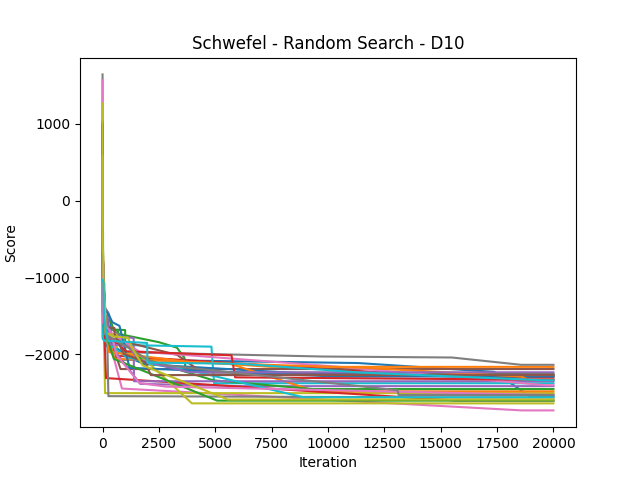
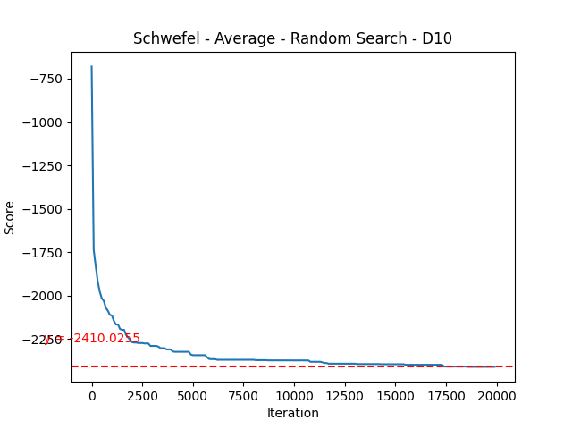


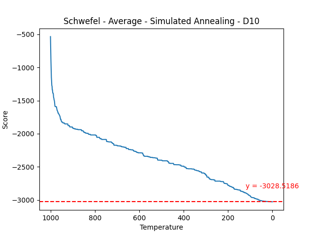

#### Dimenze 12

Kvůli špatným výsledkům pro nižší dimenze jsem se rozhodl otestovat i dimenzi 12, tady už je značně lepší simulované 
žíhání. I tak se ale konzistentně nepřibližuje globálnímu optimu a končí v optimech lokálních.


## Knapsack úloha

Dle zadání jsem se rozhodl u všeho pracovat 

Parametry:

### Dimenze 15

Random search si vedl dobře v malém prostoru a dokázal se v průměru přiblížit k optimu o 1. Naproti tomu annealing
i v menší dimenzi dokázal v průměru najít téměř 2x lepší řešení.

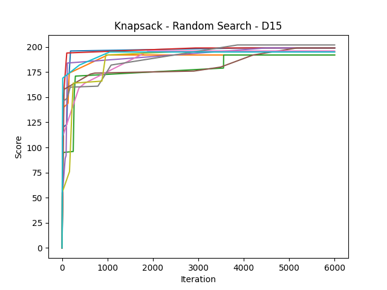 
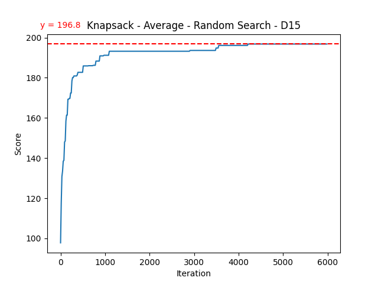 

 
  

### Dimenze 30

Random search si vedl dobře v malém prostoru a dokázal se v průměru přiblížit k optimu o 1. Naproti tomu annealing
i v menší dimenzi dokázal v průměru najít téměř 2x lepší řešení.

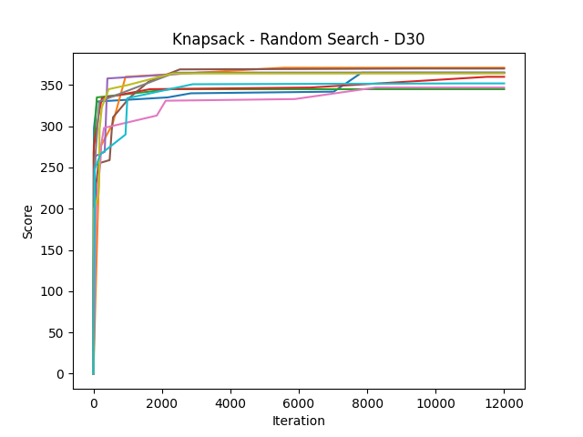 
 

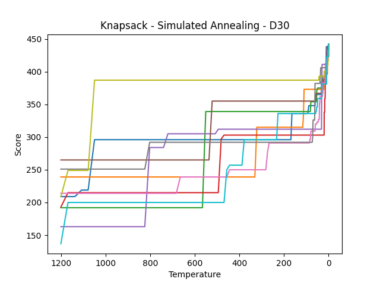 
  

### Dimenze 50

Ve větší dimenzi annealing podává v průměru víc než 2x lepší výsledek.

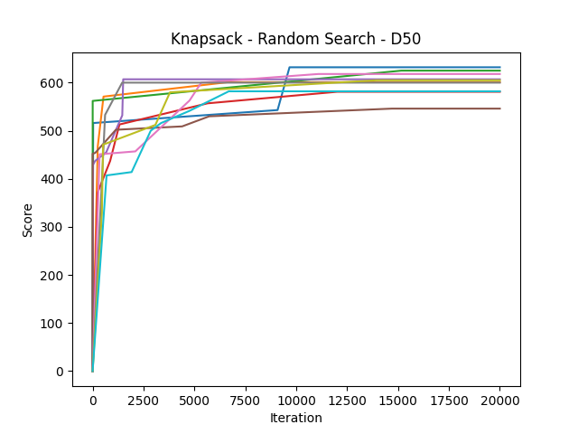 
 

 
  