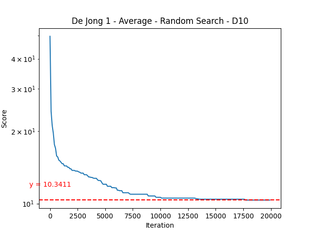
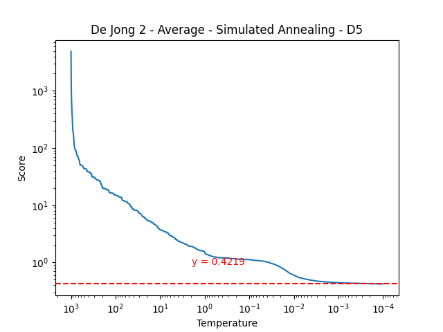

# ZÁPOČTOVÝ ÚKOL DO MATEMATICKÉ INFORMATIKY

## Osnova

1. [Benchmarking úloha](#benchmarking-úloha)
2. [Praktická úloha](#praktická-úloha)

## Benchmarking úloha

Dle zadání jsem se rozhodl u všeho pracovat 

### Dejong1

Pro dejongovu první funkci jsem zvolil FES 20000. To tedy představovalo 20000 iterací random search a 20 iterací
metropolisu v simulovaném žihání. Konkretně annealing měl při této funkci parametry teplota = 1000, 
std odchylka = 0.45 a cílová teplota = 0.0001.

Jako hranice byl zvolen rozsah [-5  5]

#### Dimenze 5

Random search si vedl dobře v malém prostoru a dokázal se v průměru přiblížit k optimu o 1. Naproti tomu annealing
i v menší dimenzi dokázal v průměru najít téměř 2x lepší řešení.

 

#### Dimenze 10

Ve větší dimenzi annealing podává v průměru víc než 2x lepší výsledek.

### Dejong1

Pro dejongovu první funkci jsem zvolil FES 20000. To tedy představovalo 20000 iterací random search a 20 iterací
metropolisu v simulovaném žihání. Konkretně annealing měl při této funkci parametry teplota = 1000, 
std odchylka = 0.45 a cílová teplota = 0.0001.

Jako hranice byl zvolen rozsah [-5  5]

#### Dimenze 5

Random search si vedl dobře v malém prostoru a dokázal se v průměru přiblížit k optimu o 1. Naproti tomu annealing
i v menší dimenzi dokázal v průměru najít téměř 2x lepší řešení.

 

#### Dimenze 10

Ve větší dimenzi annealing podává v průměru víc než 2x lepší výsledek.

